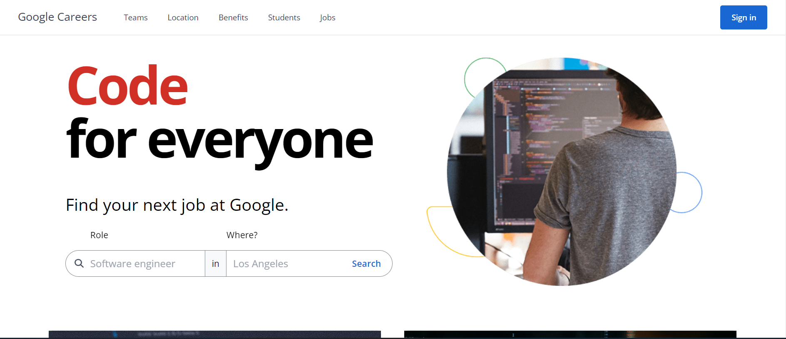

<div id="top"></div>


<!-- PROJECT LOGO -->
<div align="center">
  <br>
  <a href="https://modern-careers-clone.vercel.app/">
      
    </a>
  <br>
  <br>

  <p align="center">
  <a href="https://modern-careers-clone.vercel.app/">View Demo</a>
    ·
    <a href="https://github.com/ahmedalam98/Google-Careers-Clone/issues">Report Bug</a>
  </p>
</div>

<!-- TABLE OF CONTENTS -->
<details>
  <summary>Table of Contents</summary>
  <ol>
    <li>
      <a href="#about-the-project">About The Project</a>
      <ul>
        <li><a href="#built-with">Built With</a></li>
      </ul>
    </li>
    <li>
      <a href="#getting-started">Getting Started</a>
      <ul>
        <li><a href="#installation">Installation</a></li>
        <li><a href="#ports-and-endpoints">Ports and EndPoints</a></li>
      </ul>
    </li>
    <li><a href="#contributing">Contributing</a></li>
  </ol>
</details>

<!-- ABOUT THE PROJECT -->

## About The Project

Google Careers site clone using Vue.js



### Built With

- Vue
- Vuex
- Vue Router
- Vue Test Utils / Jest
- Typescript
- Tailwind.CSS
- Json-server

<p align="right">(<a href="#top">back to top</a>)</p>

---

<!-- GETTING STARTED -->

## Getting Started

This project require some perquisites and dependencies to be installed, you can view it online using this [demo](https://modern-careers-clone.vercel.app/). or you can find the instructions below:

> To get a local copy, follow these simple steps :

### Installation

#### installing Locally

1. Clone the repo

   ```sh
   git clone https://github.com/ahmedalam98/Google-Careers-Clone.git
   ```

2. go to project folder

   ```sh
   cd Google-Careers-Clone
   ```

3. install dependencies

   ```bash
   npm run install
   ```

4. Environmental Variables Set up

   - Here are the environmental variables that needs to be set in the `.env` file in the **main directory**.
   - These are the default setting that I used for development, but you can change it to what works for you.

   ```
    VUE_APP_API_URL=http://localhost:3000
   ```

5. Run development server

   ```sh
   npm run start
   ```

#### Running Unit Tests

- Run tests with coverage

  ```
  npm run test:unit
  ```

- Run tests with watcher

  ```
  npm run test:watch
  ```

<p align="right">(<a href="#top">back to top</a>)</p>

---

### Ports and EndPoints

#### Ports

- FrontEnd Development Server runs on port `8080`
- BackEnd Development Server runs on port `3000`

#### API endpoints

**Main URL**: [http://localhost:3000](http://localhost:3000)

- Jobs: [http://localhost:3000/jobs](http://localhost:3000/jobs) [GET]
- Spotlights: [http://localhost:3000/spotlights](http://localhost:3000/spotlights) [GET]

<p align="right">(<a href="#top">back to top</a>)</p>

---

<!-- CONTRIBUTING -->

## Contributing

Contributions are what make the open source community such an amazing place to learn, inspire, and create. Any contributions you make are **greatly appreciated**.

If you have a suggestion that would make this better, please fork the repo and create a pull request. You can also simply open an issue with the tag "enhancement".
Don't forget to give the project a star! Thanks!

1. Fork the Project
2. Create your Feature Branch (`git checkout -b feature/AmazingFeature`)
3. Commit your Changes (`git commit -m 'Add some AmazingFeature'`)
4. Push to the Branch (`git push origin feature/AmazingFeature`)
5. Open a Pull Request

<p align="right">(<a href="#top">back to top</a>)</p>
